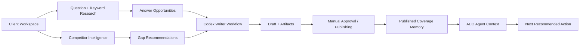
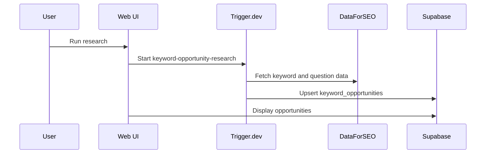
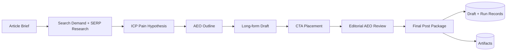

# Peekaboo - Codex-Powered AEO Workspace

Peekaboo helps teams find the questions their buyers ask, expose the answer gaps competitors are winning, and turn those opportunities into citation-ready content workflows for answer engines.

The product is built around answer engine optimization (AEO): content that gives direct, structured, useful answers that can be understood by search engines, AI assistants, and human readers.

## What Peekaboo Does

Peekaboo gives each client a command center for answer visibility work:

- manages client context, audience, brand voice, language, and location
- discovers keyword and question opportunities with DataForSEO
- analyzes competitor gaps and domain intersections
- turns opportunities or competitor recommendations into article workflows
- stores workflow artifacts, drafts, and run history
- tracks manually approved or published content as coverage memory
- provides a Codex-style AEO agent that reads the client's context and proposes next actions for human approval

## Core Product Workflow



## Tech Stack

- Next.js dashboard for clients, keywords, competitor intelligence, drafts, runs, and agent chat
- Supabase Postgres + Storage for app data, workflow artifacts, and memory
- Trigger.dev jobs for long-running background workflows
- DataForSEO for keyword, SERP, and competitor data
- Gemini/LLM agents for strategy, writing, review, and chat reasoning

## Main Flows

### 1. Keyword And Question Research

Finds and stores answer-ready content opportunities for a client.



### 2. Competitor Intelligence

Fetches competitor data, identifies answer gaps, and creates recommendations.

Modes:

- `fetch_and_analyze`: calls DataForSEO, stores a new snapshot, then analyzes it
- `analyze_only`: reuses the latest saved snapshot and reruns strategy without new DataForSEO calls
- `fetch_only`: stores fresh competitor data without generating recommendations

### 3. AEO Article Workflow

Turns a keyword, question, or recommendation into a draft.



## AEO Agent Chat

The Agent tab is a human-approved workflow agent. It reads client context, answers questions, and proposes controlled actions.

The agent can currently:

- explain current AEO context
- recommend what keyword, question, or article to prioritize
- refresh competitor data with DataForSEO after approval
- rerun analysis on the latest saved snapshot without fetching
- open the writer from a recommendation
- remember prior agent interactions in markdown memory

It does not run scheduled jobs by itself. A future report can reuse the same executor and agent logic behind the existing background job setup.

## Data Model Highlights

Core tables:

- `clients`
- `keyword_opportunities`
- `workflow_runs`
- `article_drafts`
- `competitor_intelligence_snapshots`
- `competitor_intelligence_runs`
- `competitor_recommendations`
- `published_content_coverage`
- `agent_conversations`
- `agent_messages`

Artifacts and memory are stored in Supabase Storage, including raw DataForSEO snapshots, workflow outputs, intelligence memory, and agent memory.

## Running Locally

From `apps/web`:

```bash
npm run dev
npm run trigger:dev
```

Useful checks:

```bash
npm run check
npm run build
```

The web app needs Supabase, Trigger.dev, DataForSEO, and Gemini credentials configured in environment files.

## Project Layout

```txt
apps/web
  app/                  Next.js routes, UI pages, API routes
  app/components        App-specific React components
  components/ui         Shared UI components
  lib/                  Web-only helpers, Supabase clients, agent chat controller
  supabase/migrations   Database schema
  trigger/              Thin Trigger.dev job entrypoints
  worker/               Local worker scripts

tools/seo-agent
  src/agents            LLM agents for research, writing, review, strategy
  src/pipelines         AEO content, keyword research, and competitor intelligence pipelines
  src/integrations      Supabase artifact storage and external service adapters
  src/lib               DataForSEO, file stores, LLM clients, shared helpers
  src/schemas.ts        Shared Zod schemas
```

`tools/seo-agent` keeps its original folder name to avoid import and migration churn, but it now owns Peekaboo's AEO workflow engine.
